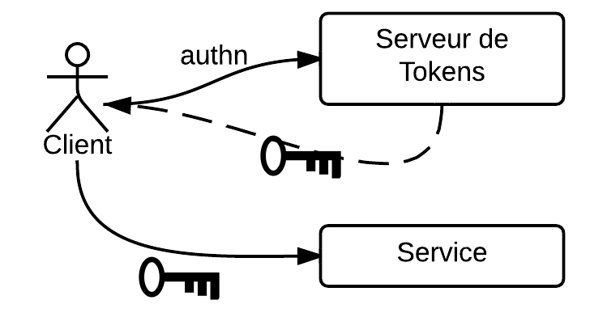
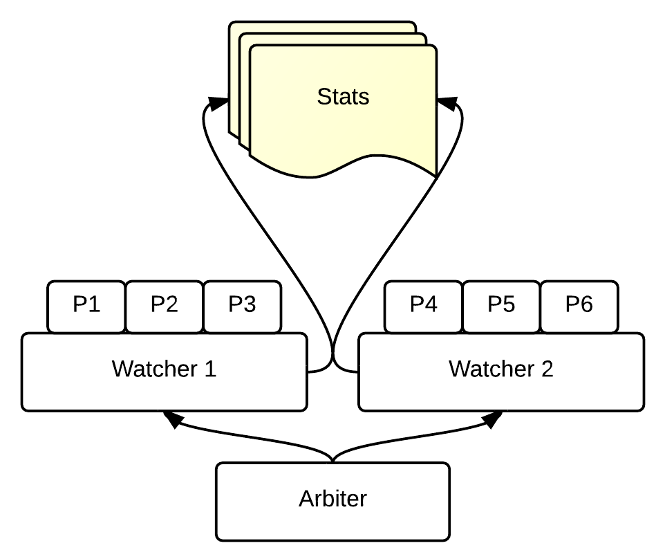
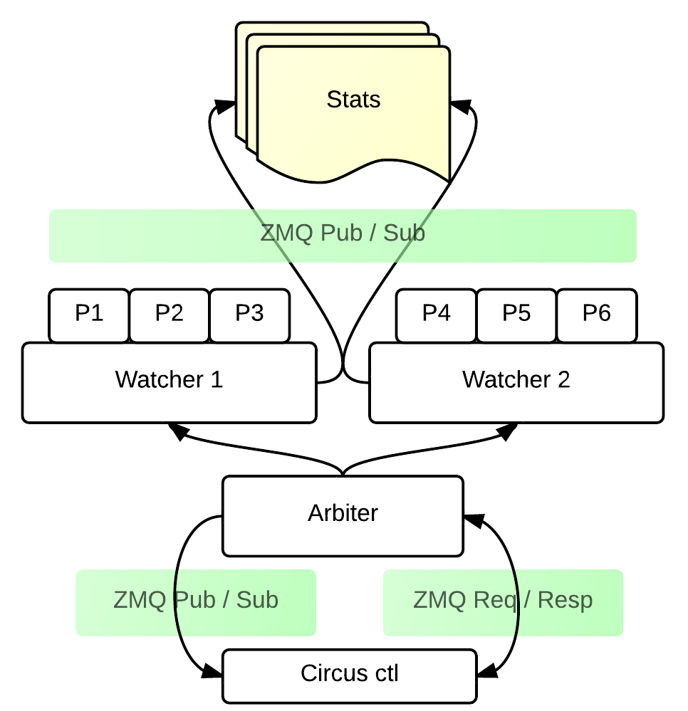

Circus, gestion de processus & sockets
######################################

----

À quoi ça sert ?
================

- Vie et mort des process
- Relancer automatiquement
- Stats par process / par service
- Gestion centralisée
- D'une machine à l'autre

----

Cas d'utilisation Mozilla
=========================

----

----

- 175 process de crypto / machine
- Limites de Popen
- Ajouter / virer des workers à la volée

----

Par rapport aux "autres"
========================

- Notre besoin: **Évolutif, en python**
- *Supervisord*: python, pas trop extensible, pas de streaming de stdout
- *Bluepill*: bien mais: DSL à apprendre, pas très "mature", en ruby.

----

Et donc …
=========

- Utilisation de zmq
- gestion possible à distance
- Stats en temps réel
- Streaming de stdout / stderr
- Facilement extensible (pas forcement en python)
- Gestion des sockets

----

À quoi ça ressemble ?
=====================

.. code-block:: ini

    [watcher:dummy]
    cmd = /chemin/vers/votre/executable $(circus.wid)
    numprocesses = 5

    [plugin:flapping]
    use = circus.plugins.flapping.Flapping
    retry_in = 3
    max_retry = 2

→ `circusd monfichier.ini`

----

Architecture
============

----

----

----

----

Gestion des sockets
===================

.. code-block:: ini

    [circus]
    endpoint = tcp://127.0.0.1:5555
    pubsub_endpoint = tcp://127.0.0.1:5556
    stats_endpoint = tcp://127.0.0.1:5557

    [watcher:web]
    cmd = chaussette --fd ${socket:web} server.app
    use_sockets = True
    numprocesses = 5

    [socket:web]
    host = 0.0.0.0
    port = 8000

* Un file descriptor est partagé entre plusieurs workers
* Gestion au niveau système

----

Stack classique
===============

.. image:: imgs/classical-stack.png
    :width: 600px

----

Stack circus
============

.. image:: imgs/circus-stack.png
    :width: 600px

----

Démo
====

----

Étendre circus
==============

----

.. code-block:: python

    from circus.plugins import CircusPlugin

    class Logger(CircusPlugin):

        name = 'logger'

        def __init__(self, filename, **kwargs):
            super(Logger, self).__init__(**kwargs)
            self.filename = filename
            self.file = None

        def handle_init(self):
            self.file = open(self.filename, 'a+')

        def handle_stop(self):
            self.file.close()

        def handle_recv(self, data):
            topic, msg = data
            self.file.write('%s::%s' % (topic, msg))

----

Mais pas uniquement en python !
===============================

----

Le futur de circus
==================

----

* **0.6**: dans les jours qui arrivent (env variables, support des tunnels ssh, hooks…)
* **0.7**: Gestion du clustering, cadeau de noël ?

.. image:: imgs/bear.gif

----

Merci !
=======

- http://circus.io (doc)
- http://github.com/mozilla-services/circus
- #mozilla-circus sur irc.freenode.net

.. role:: strike
    :class: strike
