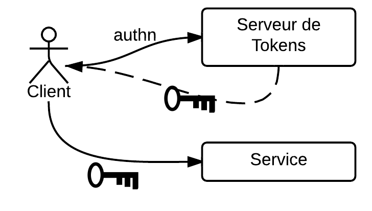
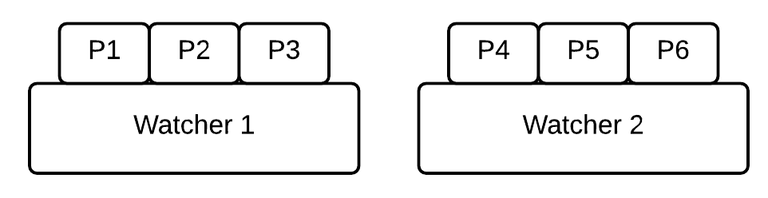
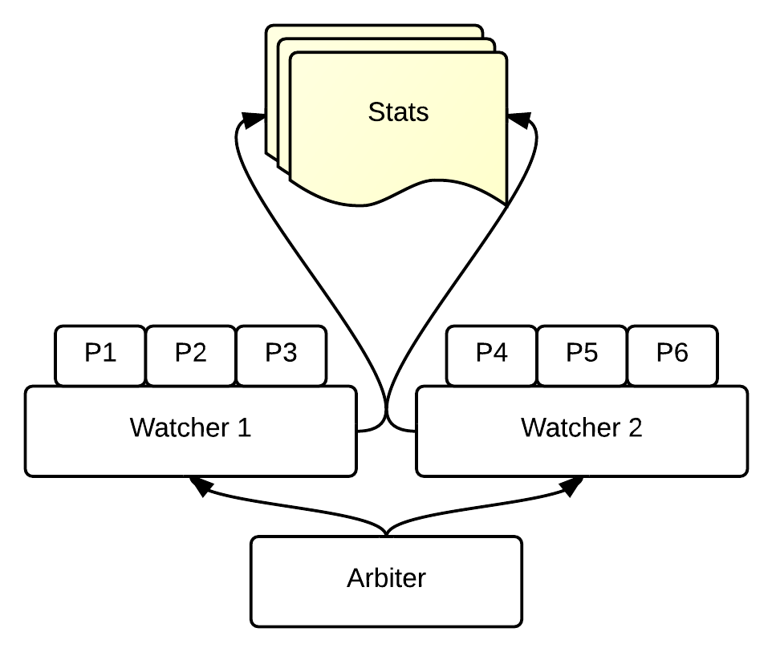
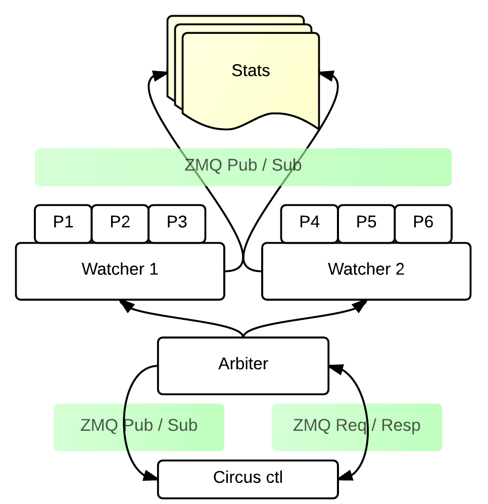

Circus, process & socket management
###################################

----

So what's that?
================

- Life & Death of processes
- respawn them automatically
- Stats per process / per service
- Centralized service
- You can connect from a machine to the other

----

What do we do from that?
=========================

----

----

- 175 crypto processes / machine
- Popen… man.
- Add / workers on the fly

----

So …
=========

- zmq
- possible to deal with it from somewhere else
- Real time stats
- Stdout / stderr streaming
- Easy to extend (you don't need python here)
- Handle sockets

----

What is this?
=====================

.. code-block:: ini

    [watcher:dummy]
    cmd = /path/to/executable $(circus.wid)
    numprocesses = 5

    [plugin:flapping]
    use = circus.plugins.flapping.Flapping
    retry_in = 3
    max_retry = 2

→ `circusd myfile.ini`

----

Architecture
============

----

----

----

----

Socket handling
===================

.. code-block:: ini

    [circus]
    endpoint = tcp://127.0.0.1:5555
    pubsub_endpoint = tcp://127.0.0.1:5556
    stats_endpoint = tcp://127.0.0.1:5557

    [watcher:web]
    cmd = chaussette --fd ${socket:web} server.app
    use_sockets = True
    numprocesses = 5

    [socket:web]
    host = 0.0.0.0
    port = 8000

* a shared FD between workers
* managemnt at the system level

----

Classical stack
===============

.. image:: imgs/classical-stack.png
    :width: 600px

----

Circus Stack
============

.. image:: imgs/circus-stack.png
    :width: 600px

----

Demo ?
======

----

How to extend it
================

----

.. code-block:: python

    from circus.plugins import CircusPlugin

    class Logger(CircusPlugin):

        name = 'logger'

        def __init__(self, filename, **kwargs):
            super(Logger, self).__init__(**kwargs)
            self.filename = filename
            self.file = None

        def handle_init(self):
            self.file = open(self.filename, 'a+')

        def handle_stop(self):
            self.file.close()

        def handle_recv(self, data):
            topic, msg = data
            self.file.write('%s::%s' % (topic, msg))

----

The future?
===========

----

* **0.7** will probably handle clustering?

.. image:: imgs/bear.gif

----

Merci !
=======

- http://circus.io (doc)
- http://github.com/mozilla-services/circus
- #mozilla-circus sur irc.freenode.net
