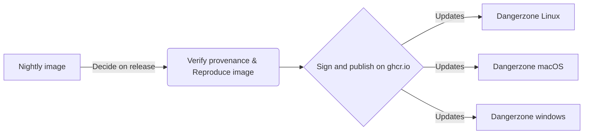
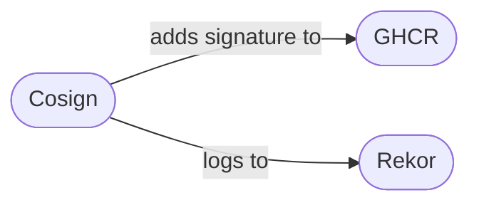

## Independent Container Updates

How to have auto-updated container images in Dangerzone 

<div class="abs-br m-6 text-xl">
  <a href="https://github.com/freedomofpress/dangerzone" target="_blank" class="slidev-icon-btn">
    
  </a>
</div>

---
transition: fade-out
layout: image-right
image: /assets/goals.jpg
---

# Why independent container updates?

<v-clicks>

1. Split container images updates from releases

    *e.g. avoid issuing a new release for each container image update*

2. Quickly patch security holes in container images
    
    *Dangerzone releases take a non-trival amount of work*

</v-clicks>

---
---

# Overview



---
layout: image-right
image: /assets/roadmap.jpg
---

# Introductory concepts

- provenance
- sigstore/cosign
- reproducible builds

---

## Provenance / Attestations

We want to have some proof that images are built in a specific way.

```
./dev_scripts/dangerzone-image attest-provenance ghcr.io/freedomofpress/dangerzone/dangerzone
  --repository freedomofpress/dangerzone
  --commit "e67fbc1e72ca35a05bf103711e790ef43f1b0978"
  --branch test/image-publication-cosign

🎉 Successfully verified image 'ghcr.io/freedomofpress/dangerzone/dangerzone' and its associated claims:
- ✅ SLSA Level 3 provenance
- ✅ GitHub repo: freedomofpress/dangerzone
- ✅ GitHub actions workflow: .github/workflows/multi_arch_build.yml
- ✅ Git branch: test/image-publication-cosign
- ✅ Git commit: e67fbc1e72ca35a05bf103711e790ef43f1b0978
```

The attestations are stored **in the ghcr.io** registry

---

## Sigstore

A set of tools to sign assets and verify them.

<div class="flex items-center">
  <div><strong>Cosign</strong>

  Sign and verify artifacts and containers, with storage in an OCI registry
  </div>
  <div><strong>Rekor</strong>
  
  Append-only, auditable transparency log service
  </div>
  <div><strong>GHCR</strong>
  
  The Github Container Registry, where images are published
  </div>
</div>



---

## Sigstore (2)

Publishes signatures and attestations to the container registry, as blobs,

at `ghcr.io/freedomofpress/dangerzone/dangerzone`

<v-clicks>

- Attestations at `sha256-<digest>.att` [example](https://github.com/almet/dangerzone/pkgs/container/dangerzone%2Fdangerzone/350028805?tag=sha256-f8272c640073981c0d7aec49f107ecbae4d322f016b1d72799e2f03e4659cd72.att) [logs](https://search.sigstore.dev/?hash=f8272c640073981c0d7aec49f107ecbae4d322f016b1d72799e2f03e4659cd72)

- Signatures at `sha256-<digest>.sig`  [example](https://github.com/almet/dangerzone/pkgs/container/dangerzone%2Fdangerzone/349693534?tag=sha256-003bf03643ee2e31dde2884278535ea10bf474d482d41f18626b9b9cce20d369.sig) [logs](https://search.sigstore.dev/?uuid=108e9186e8c5677a2edf1570d2d9df8f5e8295be32e0429e6e99aa6a880d1d73abd873390b700324)

- Rekor logs allow to tie an identity (Github in this case) to signatures / attestations, and also allows to audit it.

</v-clicks>

---

## Reproducible builds

- We do not want to trust images built by the Github CI runners blindly
- But we can verify we can reproduce the same containers locally before signing them!

More info on [https://reproducible-builds.org/](https://reproducible-builds.org/)

---

## Public / Private keys?

- Bundle a public key we trust with each release
- Sign the containers we want to distribute with this key
- We're using a yubikey for this

```
-----BEGIN PUBLIC KEY-----
MFkwEwYHKoZIzj0CAQYIKoZIzj0DAQcDQgAEoE0CXLGff79fR8KyPnSvOY74UBkt
2sLi+aVFUzS1Qwt4wosxHhcDN2B6QSsLlvgsH82q6qcA6PL2SdS/p4jWGA==
-----END PUBLIC KEY-----
```

---
layout: center
---

# Demo time !

---

# Future work

- Use rekor log index to ensure updates are only going upwards
- Let users decide if they want to auto-update or not (opt-out? opt-in?)

---
layout: image
image: /assets/discussion.jpg
---


