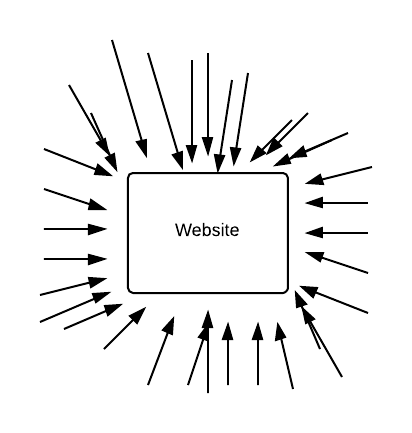
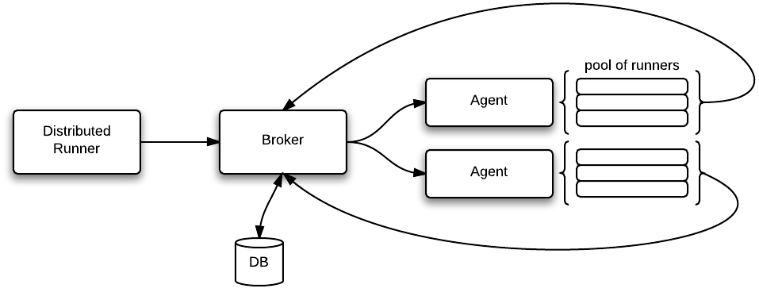
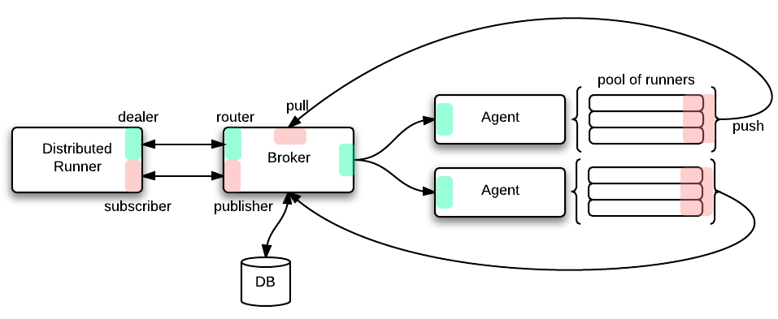

Outils de montée en charge
##########################

* Alexis Métaireau, Mozilla Services.

----

Quels sites ?
=============

* Firefox Marketplace
* Firefox Sync
* addons.mozilla.org
* …

----

Approche naïve
==============

* Temps de réponse ?
* Status (== 200 OK)
* Beaucoup de requêtes en parallèle
* → Apache Bench (AB)

----

----

Approche + réaliste
===================

* Avoir des scénarios
* Lecture de données en même temps que de l'écriture de données
* Par exemple: 

1. - Soumettre une application
2. - Chercher parmi les applications
3. - Faire des revues d'applications

----

.. code-block:: python

    from funkload.FunkLoadTestCase import FunkLoadTestCase

    class TestMarketplace(FunkLoadTestCase):

        def view_homepage(self):
            ret = self.get('/')
            self.assertTrue('Categories' in ret.body)

        def search_app(self, query='twi'):
            ret = self.get('/search/?q=%s' % query)
            self.assertTrue('Search Results' in ret.body)

        def test_end_user(self):
            self.setBasicAuth('enduser@mozilla.com', read_password())
            try:
                self.view_homepage()
                self.search_app()
                self.rate_app()
                # self.install_free_app()
                # etc.
            finally:
                self.clearBasicAuth()

----

.. code-block::

    $ fl-run-bench loadtest.py TestMarketplace

Ce qui donne des reports comme http://funkload.nuxeo.org/report-example/test_simple-20110126T232251/

----

Funkload + files d'attente = Marteau
====================================

* Pool de machines prête à lancer des tests
* Gestion d'une file d'attente / interface web: marteau

----

Évolution
=========

* Quelques soucis à faire évoluer Funkload
* Pas de feedback temps réel
* Pas d'implémentations dans d'autres langages (Js entre autres)
* Pas de support des websockets

----

C'est parti !
=============

* Réutilisation d'API connues et utilisées (requests, webtest)
* Agnostic au langage de la suite de tests (`JS <https://github.com/mozilla-services/loads.js/blob/master/index.js#L44>`_, Python, Go…)
* Support des websockets
* Garder la compatibilité avec unittest / nose

----

.. code-block:: python

    from loads import TestCase

    class StressTest(TestCase):

        server_url = "http://your-server"

        def test_something(self):
            resp = self.app.get('/your/url', status=[200, 404])
            self.assertTrue(resp.body != '')
            # ...

        def test_sockets(self):
            def callback(m):
                data = json.loads(m.data)
                self.assertIn('status', data.keys())
                self.assertIn(200, data.values())

            ws = self.create_ws('ws://localhost:8080',
                                 callback=callback)

----

----

----

Features ?
==========

* Possibilité de détacher le client durant un run
* Support de sorties dans différents formats
* Facile à utiliser avec n'importe quel langage / framework de tests grace à zmq
* Interfaçage avec Amazon Web Services pour créer des agents à la volée

----

Quelques liens
==============

* Loads: https://github.com/mozilla-services/loads && http://loads.rtfd.org
* Funkload: http://funkload.nuxeo.org/
* Requests: http://docs.python-requests.org/
* Webtests: http://webtest.pythonpaste.org/en/latest/
* Marteau: https://github.com/mozilla-services/marteau

----

Merci !
=======

* Alexis Métaireau
* http://notmyidea.org
* @ametaireau
